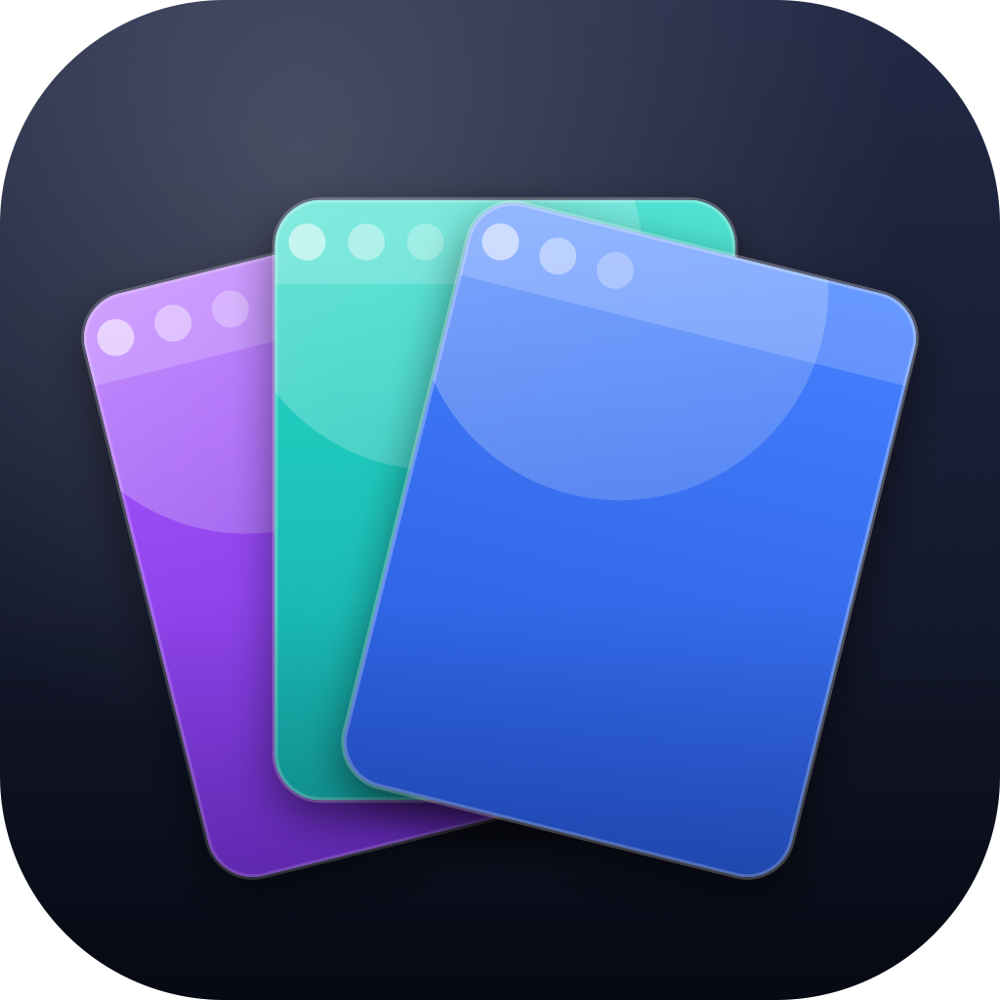

# Polychrome

A native macOS menubar app for managing Google Chrome profiles. Open profiles individually, focus existing windows without spawning duplicates, and tile multiple profile windows side-by-side with one click.

<p align="center">
  
</p>

## Features

- **All Chrome profiles in one menubar dropdown** — auto-detected from Chrome's `Local State`. Avatars, display names, emails.
- **Single-click launch or focus** — if a profile's window already exists, Polychrome focuses it instead of spawning a duplicate.
- **Multi-select + side-by-side tiling** — pick N profiles, click *Side-by-side*, and Polychrome arranges their windows on your display per your chosen layout (Smart, Row, Column, Grid, Split-H, Split-V).
- **Custom global hotkey** — record any shortcut to open the menu from anywhere.
- **Live profile refresh** — file system watch on Chrome's `Local State` updates the list when you add/edit profiles.
- **Configurable display target** — tile on main display or any connected screen.
- **Privacy toggle** — hide emails in the menu for screen-sharing.

## Requirements

- macOS 13 (Ventura) or later
- Google Chrome installed at the standard location
- Accessibility permission (required for window tiling and duplicate detection)

## Install

### Download DMG

1. Grab the latest `.dmg` from the [Releases](https://github.com/joymadhu49/Polychrome/releases) page.
2. Open the DMG and drag **Polychrome** into `/Applications`.
3. Launch Polychrome. The icon appears in your menubar.
4. The first time you use *Side-by-side*, macOS will prompt for Accessibility access — grant it in **System Settings → Privacy & Security → Accessibility**.

Release DMGs are **signed with a Developer ID certificate and notarized by Apple**, so they open normally — no "move to Trash" prompt and no right-click workaround.

### Build from source

```bash
git clone https://github.com/joymadhu49/Polychrome.git
cd Polychrome
bash scripts/build.sh
open build/Polychrome.app
```

Requires Swift 5.9+ (ships with Xcode 15 or Command Line Tools).

## Usage

| Action | How |
|---|---|
| Open menu | Click menubar icon, or press your global hotkey (default ⌘⇧C) |
| Launch / focus a profile | Click any profile row |
| Select multiple | Toggle **Multi-select**, then click profiles |
| Tile side-by-side | After selecting 2+, click **Side-by-side** |
| Refresh profiles | Click the refresh icon next to the toolbar |
| Change layout | **Settings → Side-by-Side** |
| Rebind hotkey | **Settings → Hotkeys**, click the recorder, press your combo |
| Hide emails | **Settings → Appearance** |

## Why it isn't broken when Chrome already runs

Polychrome reads Chrome's window titles via the macOS Accessibility API to detect whether a given profile already has a window open. If so, it raises that window. Otherwise it spawns a fresh one via `open -na "Google Chrome" --args --profile-directory=<dir>`.

Detection parses Chrome's **Accessibility** window title, which — unlike the AppleScript title — carries the active profile once more than one profile has been used: `"<page> - <App> - <givenName>"`, or `"<page> - <App> - <givenName> (<profile name>)"` when the profile `name` differs from its `gaia_given_name`. The parser tolerates hyphen/em-dash/en-dash separators and matches the profile's `displayName` (Local State `name`). Single-profile browsers (Brave, or Chrome with one profile) omit the marker and are handled by a lone-window + `lsof` activity check instead.

## Architecture

```
Sources/ChromeProfiles/
├── App/
│   ├── ChromeProfilesApp.swift     @main + Settings scene placeholder
│   ├── AppDelegate.swift           Wires StatusBarController + Settings window
│   └── StatusBarController.swift   NSStatusItem + NSPopover host
├── Models/
│   ├── ChromeProfile.swift         dirName, name, email, avatar
│   ├── AppSettings.swift           ObservableObject with all prefs
│   ├── LayoutConfig.swift          Tile layout + display selection
│   └── HotkeyConfig.swift          Carbon keyCode + modifiers + display string
├── Services/
│   ├── ChromeProfileLoader.swift   Parses Local State, watches via DispatchSource
│   ├── ChromeLauncher.swift        open -na, launchOrFocus, launchMany
│   ├── WindowFinder.swift          AX title matching → AXUIElement per profile
│   ├── WindowTiler.swift           Geometry math + launch-and-tile orchestration
│   ├── HotkeyManager.swift         Carbon RegisterEventHotKey
│   ├── LaunchAtLogin.swift         SMAppService.mainApp
│   ├── AXPermission.swift          AXIsProcessTrustedWithOptions
│   └── DisplayService.swift        NSScreen enumeration
└── Views/
    ├── MenuView.swift              Popover root (search, list, multi-action, footer)
    ├── ProfileRow.swift            Avatar + name + email + open-state dot
    ├── SettingsView.swift          NavigationSplitView with 5 panes
    └── HotkeyRecorder.swift        NSEvent local monitor capture
```

## How tiling works

1. `WindowTiler.launchAndTile(profiles:, config:)` is called with a selected set.
2. `WindowFinder.allWindowsMappedToProfiles` resolves which already exist via AX title match.
3. Missing profiles are launched **in parallel** via `open -na`.
4. The window list is polled every 50 ms (up to ~2 s) until all profiles resolve.
5. Frames are computed for the chosen layout on the chosen display, then `kAXPositionAttribute` and `kAXSizeAttribute` are set per window.

Coordinate note: AX uses top-left origin on the primary display, while `NSScreen` uses bottom-left. `WindowTiler.primaryFlipped` handles the conversion.

## Configuration files

| Path | Purpose |
|---|---|
| `~/Library/Preferences/com.joymadhu.polychrome.plist` | UserDefaults: launchAtLogin, showEmails, focusExisting, hotkey, layout |
| `~/Library/Application Support/Google/Chrome/Local State` | Read-only: source of profile metadata |

Polychrome never writes to Chrome's data.

## Building a DMG

```bash
bash scripts/make-dmg.sh
# → build/Polychrome-1.0.0.dmg
```

## Releasing (signed + notarized)

Releases are cut by **GitHub Actions** (`.github/workflows/release.yml`): push a version
tag and CI builds, Developer ID-signs, notarizes, staples, and attaches the DMG to the
GitHub Release.

```bash
# bump CFBundleShortVersionString in Bundle/Info.plist first, then:
git tag v1.3.2
git push origin v1.3.2
```

One-time setup — add these repository secrets (**Settings → Secrets and variables → Actions**):

| Secret | What it is |
|---|---|
| `DEVELOPER_ID_CERT_P12` | base64 of your exported *Developer ID Application* cert (`base64 -i cert.p12 \| pbcopy`) |
| `DEVELOPER_ID_CERT_PASSWORD` | password you set when exporting the `.p12` |
| `KEYCHAIN_PASSWORD` | any random string (temp keychain on the runner) |
| `AC_API_KEY_P8` | base64 of your App Store Connect API key (`.p8`) |
| `AC_API_KEY_ID` | the API Key ID |
| `AC_API_ISSUER_ID` | the API Issuer ID |

To sign + notarize **locally** instead, see the header of `scripts/notarize.sh`:

```bash
POLYCHROME_SIGNING_IDENTITY="Developer ID Application" bash scripts/build.sh
bash scripts/make-dmg.sh
AC_KEYCHAIN_PROFILE=polychrome-notary bash scripts/notarize.sh
```

## Regenerating the icon

```bash
# Drop a 1024×1024 PNG at Bundle/AppIcon.png
bash scripts/make-icon.sh
```

## Limitations

- Profile detection requires Chrome to be installed at `/Applications/Google Chrome.app`.
- Window-to-profile mapping relies on Chrome rendering profile names in window titles (true when multiple profiles are loaded — Chrome's default).
- Local dev builds use a stable self-signed identity (`scripts/setup-signing.sh`) and are **not** notarized; only the CI-built release DMGs are Developer ID-signed + notarized.

## License

[MIT](LICENSE) © 2026 joymadhu
