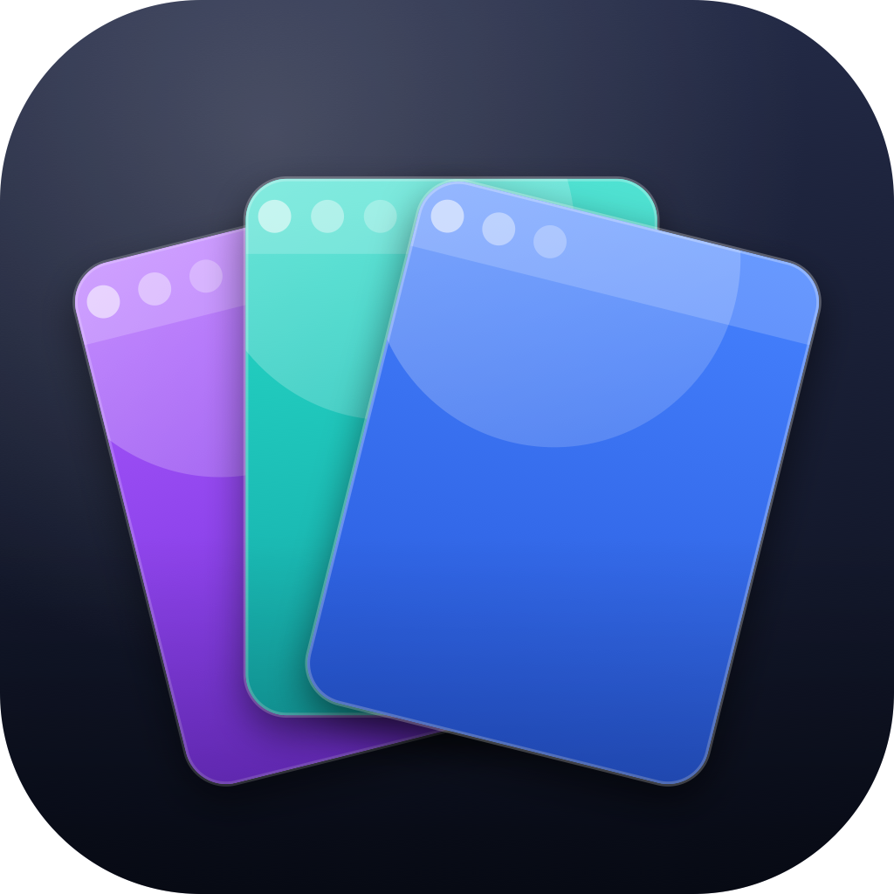

# Polychrome

[](https://github.com/joymadhu49/Polychrome/actions/workflows/ci.yml)

A native macOS menubar app for managing Google Chrome profiles. Open profiles individually, focus existing windows without spawning duplicates, and tile multiple profile windows side-by-side with one click.

<p align="center">
  
</p>

## Features

- **All Chrome profiles in one menubar dropdown** — auto-detected from Chrome's `Local State`. Avatars, display names, emails.
- **Single-click launch or focus** — if a profile's window already exists, Polychrome focuses it instead of spawning a duplicate.
- **Multi-select + side-by-side tiling** — pick N profiles, click *Side-by-side*, and Polychrome arranges their windows on your display per your chosen layout (Smart, Row, Column, Grid, Split-H, Split-V).
- **Drag & drop a link onto a profile** — drag a URL from any app over the menubar icon (the menu opens mid-drag), then drop it directly on a profile row to open it there instantly. No URL field or history is shown or retained.
- **Custom global hotkey** — record any shortcut to open the menu from anywhere.
- **Live profile refresh** — file system watch on Chrome's `Local State` updates the list when you add/edit profiles.
- **Configurable display target** — tile on main display or any connected screen.
- **Privacy toggle** — hide emails in the menu for screen-sharing.
- **Keyboard-first** — ⌘1–⌘9 open the first nine profiles (hold ⌘ to see the numbers), ↑/↓ + ↩ for the rest.
- **Automatic updates** — via [Sparkle](https://sparkle-project.org). A daily check against the latest GitHub release; every update is EdDSA-verified before it installs. The check is the only network request Polychrome makes and sends nothing about your profiles. Toggle it in **Settings → General**.

## Requirements

- macOS 13 (Ventura) or later
- Google Chrome installed at the standard location
- Accessibility permission (required for window tiling and duplicate detection)

## Install

### Download DMG

1. Grab the latest `.dmg` from the [Releases](https://github.com/joymadhu49/Polychrome/releases) page.
2. Open the DMG and drag **Polychrome** into `/Applications`.
3. Launch Polychrome. The icon appears in your menubar. From 1.5.0 on, updates arrive automatically — no more re-downloading the DMG.
4. The first time you use *Side-by-side*, macOS will prompt for Accessibility access — grant it in **System Settings → Privacy & Security → Accessibility**.

Release DMGs are **universal (Apple silicon + Intel), signed with a Developer ID certificate and notarized by Apple** — both the DMG and the app inside carry a stapled ticket, so they open normally, even offline.

### Build from source

```bash
git clone https://github.com/joymadhu49/Polychrome.git
cd Polychrome
bash scripts/build.sh
open build/Polychrome.app
```

Requires Swift 5.9+ (ships with Xcode 15 or Command Line Tools).

## Usage

| Action | How |
|---|---|
| Open menu | Click menubar icon, or press your global hotkey (default ⌘⇧C) |
| Launch / focus a profile | Click any profile row |
| Open a link in a profile | Drag the link over the menubar icon, then drop it directly on a profile row |
| Open profile 1–9 | ⌘1 … ⌘9 while the menu is open (hold ⌘ to see the numbers) |
| Select multiple | Click **Select** in the footer, then click profiles |
| Tile side-by-side | After selecting 2+, click **Tile** — the first profile you pick gets the main pane |
| Refresh profiles | ⌘R, or the ⚙︎ menu in the footer |
| Change layout | **Settings → Tiling** |
| Rebind hotkey | **Settings → Shortcuts**, click the field, press your combo |
| Hide emails | **Settings → Menu** |
| Check for updates | ⚙︎ menu → **Check for Updates…**, or **Settings → General** |

## Why it isn't broken when Chrome already runs

Polychrome reads Chrome's window titles via the macOS Accessibility API to detect whether a given profile already has a window open. If so, it raises that window. Otherwise it spawns a fresh one via `open -na "Google Chrome" --args --profile-directory=<dir>`.

Detection parses Chrome's **Accessibility** window title, which — unlike the AppleScript title — carries the active profile once more than one profile has been used: `"<page> - <App> - <givenName>"`, or `"<page> - <App> - <givenName> (<profile name>)"` when the profile `name` differs from its `gaia_given_name`. The parser tolerates hyphen/em-dash/en-dash separators and matches the profile's `displayName` (Local State `name`). Single-profile browsers (Brave, or Chrome with one profile) omit the marker and are handled by a lone-window + `lsof` activity check instead.

## Architecture

```
Sources/ChromeProfiles/
├── App/
│   ├── ChromeProfilesApp.swift     @main — plain AppKit entry point (no SwiftUI scenes)
│   ├── AppDelegate.swift           Wires StatusBarController, Settings window, hidden Edit menu
│   └── StatusBarController.swift   NSStatusItem + NSPopover host
├── Models/
│   ├── Browser.swift               Supported Chromium browsers (Chrome, Brave)
│   ├── ChromeProfile.swift         dirName, name, email, avatar
│   ├── AppSettings.swift           ObservableObject with all prefs
│   ├── LayoutConfig.swift          Tile layout + display selection
│   ├── HotkeyConfig.swift          Carbon keyCode + modifiers + display string
│   └── ProfileTag.swift            Color tags + theme override
├── Services/
│   ├── ChromeProfileLoader.swift   Parses Local State, watches via DispatchSource
│   ├── ChromeLauncher.swift        open -na, launchOrFocus, launchMany
│   ├── WindowFinder.swift          AX title matching → AXUIElement per profile
│   ├── WindowTiler.swift           Geometry math + launch-and-tile orchestration
│   ├── BrowserActivity.swift       lsof-based "which profiles are live" fallback
│   ├── HotkeyManager.swift         Carbon RegisterEventHotKey
│   ├── LaunchAtLogin.swift         SMAppService.mainApp
│   ├── UpdateController.swift      Sparkle updater + gentle in-menu update reminder
│   ├── AXPermission.swift          AXIsProcessTrustedWithOptions
│   └── DisplayService.swift        NSScreen enumeration
└── Views/
    ├── MenuView.swift              Popover root (search header, sectioned list, footer / selection bar)
    ├── ProfileRow.swift            Avatar with presence dot, name, tag, window boxes, shortcut hint
    ├── SettingsView.swift          System Settings-style grouped Form, 7 panes
    └── HotkeyRecorder.swift        NSEvent local monitor capture
```

## How tiling works

1. `WindowTiler.launchAndTile(profiles:, among:, config:)` is called with the selected set plus every known profile.
2. `WindowFinder.snapshot` resolves which already have a window, attributing windows against *all* profiles so a window naming an unselected profile never stands in for a selected one. The menu, focusing and closing use the same snapshot, so they always agree.
3. Missing profiles are launched **in parallel** via `open -na`.
4. The window list is polled every 150 ms (up to 10 s — a cold browser start takes a few seconds) until all profiles resolve. In title-opaque browsers, windows that appeared after launching are paired with the launched profiles.
5. Frames are computed for the chosen layout on the chosen display; minimized windows are restored first, then each window is sized, moved and sized again (so moving between displays of different sizes lands exactly).

Coordinate note: AX uses top-left origin on the primary display, while `NSScreen` uses bottom-left. `WindowTiler.primaryFlipped` handles the conversion.

## Configuration files

| Path | Purpose |
|---|---|
| `~/Library/Preferences/com.joymadhu.polychrome.plist` | UserDefaults: showEmails, focusExisting, hotkey, layout (launch at login is read from the system's Login Items) |
| `~/Library/Application Support/Google/Chrome/Local State` | Read-only: source of profile metadata |

Polychrome never writes to Chrome's data.

## Building a DMG

```bash
bash scripts/make-dmg.sh
# → build/Polychrome-1.0.0.dmg
```

## Releasing (signed + notarized)

Releases are **fully automatic** (`.github/workflows/release.yml`): merge a change to
`main` that bumps `CFBundleShortVersionString` **and** `CFBundleVersion` in
`Bundle/Info.plist`, and CI builds a universal binary, Developer ID-signs it, notarizes
and staples the app, wraps it in a DMG, notarizes and staples that, signs the DMG for
Sparkle, and publishes the `v<version>` GitHub Release with the DMG and `appcast.xml`.
No tag pushing, no manual steps — a push to `main` without a version bump releases nothing.

**Auto-update feed.** `SUFeedURL` points at
`releases/latest/download/appcast.xml`, which GitHub redirects to the newest release —
so publishing a release *is* publishing the update. Sparkle compares `CFBundleVersion`
(an integer, +1 per release); the release job refuses to run if you forget to bump it,
because such a release would never be offered to anyone.

Manual overrides still work: push a `v*` tag, or run the workflow from the Actions tab
(optionally with a `release_tag` input).

One-time setup — add these repository secrets (**Settings → Secrets and variables → Actions**):

| Secret | What it is |
|---|---|
| `DEVELOPER_ID_CERT_P12` | base64 of your exported *Developer ID Application* cert (`base64 -i cert.p12 \| pbcopy`) |
| `DEVELOPER_ID_CERT_PASSWORD` | password you set when exporting the `.p12` |
| `KEYCHAIN_PASSWORD` | any random string (temp keychain on the runner) |
| `AC_API_KEY_P8` | base64 of your App Store Connect API key (`.p8`) |
| `AC_API_KEY_ID` | the API Key ID |
| `AC_API_ISSUER_ID` | the API Issuer ID |
| `SPARKLE_ED_PRIVATE_KEY` | Sparkle's EdDSA private key — `.build/artifacts/sparkle/Sparkle/bin/generate_keys -x key.txt`. Its public half is `SUPublicEDKey` in `Bundle/Info.plist`. **Back it up: losing it strands every installed copy.** |

If any secret is missing, the run stays green and lists what's missing in the job
summary instead of building.

To sign + notarize **locally** instead, see the header of `scripts/notarize.sh`:

```bash
POLYCHROME_SIGNING_IDENTITY="Developer ID Application" bash scripts/build.sh
AC_KEYCHAIN_PROFILE=polychrome-notary bash scripts/notarize.sh build/Polychrome.app   # staple the app
bash scripts/make-dmg.sh
AC_KEYCHAIN_PROFILE=polychrome-notary bash scripts/notarize.sh                        # staple the DMG
bash scripts/make-appcast.sh   # signs with the key in your login keychain
```

## Regenerating the icon

```bash
# Drop a 1024×1024 PNG at Bundle/AppIcon.png
bash scripts/make-icon.sh
```

## Limitations

- Profile detection requires Chrome to be installed at `/Applications/Google Chrome.app`.
- Window-to-profile mapping relies on Chrome rendering profile names in window titles (true when multiple profiles are loaded — Chrome's default).
- Local dev builds use a stable self-signed identity (`scripts/setup-signing.sh`) and are **not** notarized; only the CI-built release DMGs are Developer ID-signed + notarized.

## Roadmap

Improvements are tracked in [IMPROVEMENTS.md](IMPROVEMENTS.md) — a living,
prioritized checklist of shipped fixes, known rough edges, and planned features.
Every push and pull request is built by CI (`.github/workflows/ci.yml`).

## License

[MIT](LICENSE) © 2026 joymadhu
